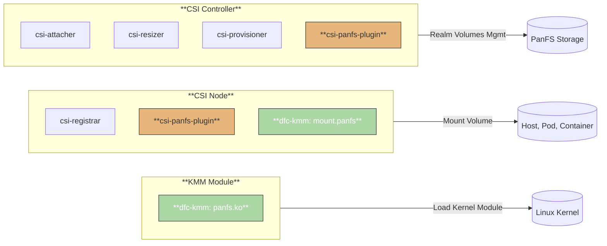

<!-- 
  Copyright 2025 VDURA Inc.

  Licensed under the Apache License, Version 2.0 (the "License");
  you may not use this file except in compliance with the License.
  You may obtain a copy of the License at

      http://www.apache.org/licenses/LICENSE-2.0

  Unless required by applicable law or agreed to in writing, software
  distributed under the License is distributed on an "AS IS" BASIS,
  WITHOUT WARRANTIES OR CONDITIONS OF ANY KIND, either express or implied.
  See the License for the specific language governing permissions and
  limitations under the License.
-->

# PanFS CSI Driver Architecture Overview

The **PanFS CSI Driver** enables Kubernetes clusters to manage **PanFS-backed persistent volumes** through the [Container Storage Interface (CSI)](https://kubernetes-csi.github.io/docs/). Designed for high availability, security, and seamless integration with Kubernetes and PanFS storage systems, it supports dynamic provisioning, attachment, and lifecycle management of volumes. The driver is production-ready and optionally integrates with the [Kernel Module Management (KMM)](https://kmm.sigs.k8s.io/) framework for dynamic kernel module delivery.

## Table of Contents

- [Architecture Overview](#architecture-overview)
  - [Architectural Flow](#architectural-flow)
- [Operational Workflow](#operational-workflow)
- [Key Features](#key-features)
- [References](#references)

---

## Architecture Overview

The PanFS CSI Driver consists of two primary components, orchestrated to handle cluster-wide and node-specific storage operations:

- **Controller Service** (Deployment):
  - Runs as a highly available deployment with multiple replicas for fault tolerance.
  - Manages cluster-wide operations: provisioning, attaching, detaching, and resizing PanFS volumes.
  - Includes sidecar containers:
    - **CSI Provisioner**: Handles volume creation.
    - **CSI Attacher**: Manages volume attachment to nodes.
    - **CSI Resizer**: Supports volume expansion.
    - **PanFS CSI Plugin**: Implements PanFS-specific logic.

- **Node Service** (DaemonSet):
  - Runs on every cluster node to handle local volume operations (mounting/unmounting).
  - Includes:
    - **CSI Node Driver Registrar**: Registers the driver with Kubernetes.
    - **PanFS CSI Plugin**: Interacts with the PanFS storage backend and local kernel, often in privileged mode for file system operations.

- **Kernel Module Management (KMM)**:
  - Optional integration to dynamically load the PanFS kernel module on nodes, ensuring compatibility with the storage backend.

- **CSIDriver Registration**:
  - Registers the driver with Kubernetes, advertising capabilities like volume attachment, SELinux support, and advanced lifecycle operations.

- **Security**:
  - Uses Kubernetes RBAC for fine-grained permissions.
  - Supports SELinux and privileged mode for secure file system operations.

### Architectural Flow

The following diagram illustrates the interaction between components:

---

## Operational Workflow

1. **Provisioning**: A PersistentVolumeClaim (PVC) referencing a PanFS StorageClass triggers the controller to create a PanFS volume.
2. **Attachment**: The controller and node services coordinate to attach the volume to the target node when a workload is scheduled.
3. **Mounting**: The node service mounts the volume into the pod with appropriate permissions and security context.
4. **Lifecycle Management**: Supports dynamic resizing, snapshotting, and volume deletion.
5. **Kernel Module Handling**: If enabled, KMM ensures the PanFS kernel module is loaded on nodes before mounting.

## Key Features

- **High Availability**: Multi-replica controller ensures fault tolerance
- **Scalability**: Separates cluster-wide (controller) and node-local (daemonset) operations
- **Security**: RBAC, SELinux, and privileged mode for secure operations
- **Flexibility**: Optional KMM for dynamic kernel module management
- **Kubernetes-Native**: Fully compatible with Kubernetes storage APIs
- **Multi-Realm Support**: Connect to multiple PanFS realms within a single CSI driver instance

---

## References

- [Makefile](../Makefile): Automation targets.
- [usage-guide.md](./usage-guide.md): Workload deployment guides.
- [kmm.md](./kmm.md): KMM setup and management.
